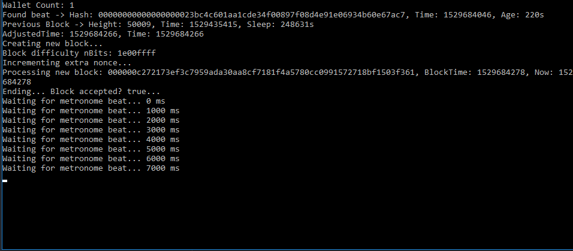
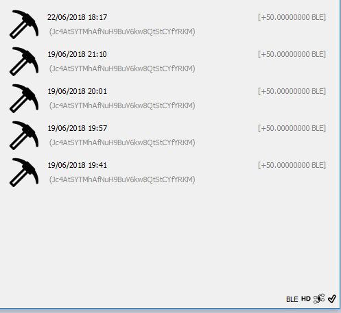

# Bitcoin LE - Reference Miner Usage

This tutorial is a step-by-step guide to use the reference Bitcoin LE miner.

## Miner Location

The reference miner is available in the zip file provided in the release. To start the miner, all needed is to run the executable called *bitcoinle-miner*. When no command line arguments are provided, then Bitcoin LE defaults apply. This means that when the miner submits a valid block, the coinbase transacation will be pointing to an address in the wallet already configured in your system.

## Miner Logs

A fully working miner shall look like the following image:

In this image, it is possible to see a successful submission of a block and also that the miner entered the rest time window, which means that it is not possible to mine during that period. Once the new beat is received, then the miner will wake up and start processing new blocks again.

It is possible to keep track of mined blocks in BitcoinLE's graphical user interface (*bitcoinle-qt*). Mined blocks will show the mining pick on the left side of the transaction (check image above).
