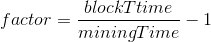
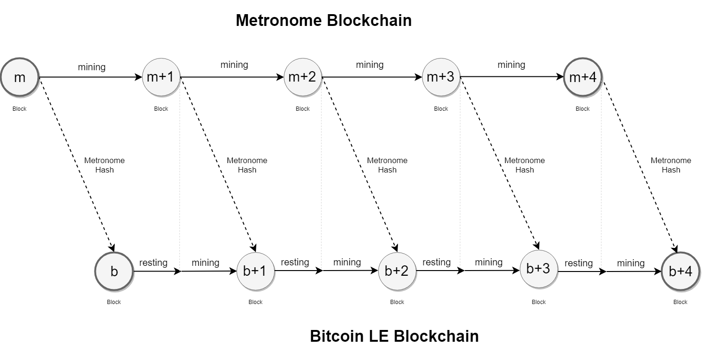
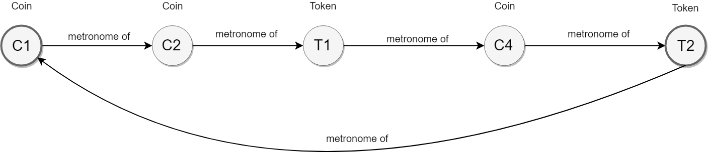
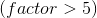

# Bitcoin LE Technical White Paper

**May 20, 2018**

**Abstract:** Bitcoin LE software introduces a new blockchain architecture designed to enable low energy, eco-friendly and decentralized Proof-of-Work-based transactions. Such capabilities are achieved by introducing a new consensus algorithm named Proof of Work Low Energy (in short: PoW-LE). This software provides wallet manipulation, new account creation, transaction management and the core features essential for a cryptography-based economy. The resulting technology is a blockchain architecture that can scale to millions of users, dramatically lower common fees, and more importantly, drastically reduce the carbon footprint of the so called work, commonly known as "mining".

Copyright © 2018 bitcoinle.org

Without permission, anyone may use, reproduce or distribute any material in this document for non-commercial and educational use (i.e., other than for a fee or for commercial purposes) provided that the original source and the applicable copyright notice are included.

**DISCLAIMER:** The Bitcoin LE Technical White Paper is for information purposes only. bitcoinle.org does not guarantee the accuracy or the conclusions reached in this white paper. The document is provided “as is”. bitcoinle.org does not make and expressly disclaims all representations and warranties, express, implied, statutory or otherwise, whatsoever, including, but not limited to: (i) warranties of merchantability, fitness for a particular purpose, suitability, usage, title or noninfringement; (ii) that the contents of this white paper are free from error; and (iii) that such contents will not infringe third-party rights. bitcoinle.org and its affiliates shall have no liability for damages of any kind arising out of the use, reference to, or reliance on this white paper or any of the content contained herein, even if advised of the possibility of such damages. In no event will bitcoinle.org or its affiliates be liable to any person or entity for any damages, losses, liabilities, costs or expenses of any kind, whether direct or indirect, consequential, compensatory, incidental, actual, exemplary, punitive or special for the use of, reference to, or reliance on this white paper or any of the content contained herein, including, without limitation, any loss of business, revenues, profits, data, use, goodwill or other intangible losses.

<!-- MarkdownTOC depth=4 autolink=true bracket=round list_bullets="-*+" -->

- [Background](#background)
- [Intoduction](#introduction)
- [Bitcoin LE](#bitcoin-le)
- [Consensus Algorithm](#consensus-algorithm)
  * [Algorithm Overview](#algorithm-overview)
  * [The Coinchain Concept](#the-coinchain-concept)
  * [Bitcoin LE Initial Setup](#bitcoin-le-initial-setup)
  * [Strengths of Bitcoin LE](#strengths-of-bitcoin-le)
- [Conclusion](#conclusion)

<!-- /MarkdownTOC -->

# Background

Blockchain technology was introduced in 2008 with the launch of the Bitcoin currency, and since then entrepreneurs and developers have attempted to make the technology more sustainable by providing technical proposals for faster transactions but also more energy-efficient transaction processing.

While many projects have struggled to support functional operations, a minority has seen an increase in support and adoption by its community of peers. This is proof that blockchain technology provides tangible benefits to the current state of the art for payment mediation and transaction processing.

Existing blockchain-based crypto-currency implementations are burdened by large fees and limited computational capacity, which prevent widespread adoption, limits its versatility, and ultimately prevent its equivalence to common fiat. In PoW deployments, such a capacity limitation positively correlates to the energy required for the mining operations. There is no solution focusing on the high carbon footprint problem. Solving, or attenuating this problem would dramatically increase the sector's credibility, and this would giving way to a larger community and wider technology adoption.

# Introduction

A blockchain is an ever-growing list of blocks, linked together in the form of a chain, where blocks’ and links’ data are secured using cryptography. These blocks comprise sets of records that can theoretically store any type of data, but its most common applications have been financial transactions. Each block contains a fingerprint (technically known as hash) of the previous block, but also a timestamp, and the transaction data itself. Because a blockchain system is intended to be distributed – more specifically replicated redundantly across several computers, or nodes, each one across a network layer - it is far from computationally trivial to tamper historical block data without controlling the majority of the node network. This public, distributed log of transactions, or ledger, is collectively managed by a protocol that ensures proper inter-node communication and data integrity. Once a transaction is submitted to a block, it cannot be changed without noticeably (to other nodes) affecting all subsequent blocks, as new blocks have information relating to every block before it encoded in one-way fashion. The network is capable of, for the most part, identifying and self-healing against such attempts, discouraging the practice of tampering. Even though theoretically possible to successfully altering a block and propagating the change to the entire network would require collusion of the majority of nodes, which is extremely unlikely, and ever-harder as the network expands in number of nodes. This property is known as Byzantine fault tolerance.

A high degree of security is therefore intrinsic to blockchain implementations. By creating a system with the previously described Byzantine fault tolerance, decentralized consensus can be achieved and induce in bullet-proof, structural confidence in decisions to be taken based on previous block historic data.

Blockchain was invented by Satoshi Nakamoto in 2008. It was created to support the cryptographic currency Bitcoin. By using the blockchain, Bitcoin was the first digital currency that effectively addressed the double-spending problem without requiring a trusted, central authority. Previous currency paradigms still include this single point of failure architecture.

The rising popularity and value of Bitcoin have nonetheless been accompanied by skepticism. One major argument involves the energy footprint of the so-called Bitcoin mining – heavy cryptographic computation - essential to new Bitcoin issuing and transaction processing. It is often stated by critics that it takes the energy equivalent of 7 to 9 households daily, simply to secure a single transaction of Bitcoin units. This energy expenditure problem is something that must be taken in high consideration, and thus actively improved, in order to be economically and ecologically viable to maintain a balanced cryptography-based ledger over time.

# Bitcoin LE

Bitcoin LE source code is forked from Bitcoin's own. Changes have been made into Bitcoin's original consensus code in order to overcome its ecological impact (the birth of PoW-LE). As a secondary improvement, Bitcoin LE's block time has been reduced to 6 minutes (instead of 10 for Bitcoin). This will allow faster transactions which will also have a much lower carbon footprint.

# Consensus Algorithm

## Algorithm Overview

Proof-of-Work-Low-Energy (PoW-LE) is the consensus algorithm behind Bitcoin LE's ecological traits. Its goal is to allow a traditional Proof-of-Work consensus, but also to enforce a mining-free time window (rest time), inside the overall block time window. During this period, no workload is required, as there is no actual benefit to it. If one develops a coin which implements a decentralized strategy forbidding mining during a specific interval, then the overall power consumption of that coin's mining activities is reduced by a factor equivalent to the ratio between block and mining periods.

For instance: in the same average hourly processed transactions as Bitcoin, Bitcoin LE's factor of 5 means that it will be 5 times more energy efficient than its predecessor. This is obviously less impactful on energy expenditure and carbon footprint, while also saving the miner's processing power, and consequently, his electric bill.

The challenge then becomes enforcing this rest time. This can be achieved by adding an additional parameter to the block; this element is then used by the network to decide when mining will be allowed again, within variable, but plausible limits. This new element will be referred to as 'metronome beat' or just 'beat' throughout this document.

By adding the beat number to the block header, and by introducing a block validation rule that ensures the block's beat time has to be posterior to the most recent block time, mining calculations are forced to wait for the next beat to arrive in order to continue. Only after such a beat is known, can miners start calculating a valid block that matches current network difficulty.

The metronome beat needs to have specific properties in order to prevent forgery or even pre-mine blocks during this rest time. The properties are as follows:
  - Metronome beat must be a number computed using accessible and widely available hardware or software
  - Metronome beat must have plausible periodicity
  - Future beats must be unpredictable
  - Past beats must be universally available, i.e. publicly known
  - It must be possible to obtain precise date and time of past beats at any given time

Finding a good metronome source that has all these properties is not trivial. A metronome that fails to contain any of the required properties is exploitable. Let's consider the following examples:
  - if beats are predictable, it would be possible to anticipate the next beat, and with that parameter pre-mine blocks that could then be submitted immediately after the beat had occurred.
  - if beats cannot be associated with a corresponding occurrence time, then it would be impossible to infer that a past beat effectively occurred after a specific block.
  - if beats are not somewhat periodic, it would not be possible to guarantee a constant production of new blocks, and therefore confirm transaction validity
  - if beats are only accessible to a few individuals of the network with exotic hardware or software, then these would possess unfair advantage as compared to other miners

The possibility of designing a specific piece of hardware that generates universal beats was considered, but that would require initial investment by potential network peers. After some research, it was pondered that the solution could be implemented within blockchain technology itself. A public and open source blockchain fulfills all requirements to become another coin's metronome. Thus, if a coin becomes a metronome, then every block hash is a valid beat.

With this quality metronome source in hand, the next step is to create a coin that implements a layer on top of the original PoW consensus algorithm. This extra layer will be responsible for verifying that the block's beat is valid, which means that the corresponding beat time has to be posterior to current block's ancestor block. Since this mechanism would exist solely to prevent energy expenditure, it can only be applied to newly created blocks. Beat validation is therefore optional for older blocks. In case of Bitcoin LE, the threshold period to perform beat validation was pondered to 1 hour - f the block is older than 1 hour, then beat validation is no longer required.

From the point of view of the miner, it only becomes necessary to keep track of the latest metronome beat, and when it effectively fulfills Bitcoin LE's validation rules, to start the mining process. This block's header must include the beat's block hash.

## The Coinchain Concept

Since there are many digital coins available, there are also a lot of potential candidate metronomes. As Bitcoin was the first crypto coin, it was decided to use it as our first metronome as an homage. If you think that some other coin is better suited for the task, feel free to bring it to the discussion. Note that there is nothing in current Bitcoin LE specification preventing metronome change in the future, as long as more than 50% of Bitcoin LE's nodes agree with it.

In order to maximize energy savings, the metronome chain has to be accounted for. Therefore, the optimal system should verify the following condition:

NOTE: we consider ROIW as the average return on invested watt

It must always be much more rewarding to mine Bitcoin LE than to mine the metronome. In a best-case scenario, mining the metronome coin should not be profitable at all. This would discourage miners to spend processing workloads on it. Theoretical coin properties that would make it less desirable, but still secure, can be:
  - High coin inflation
  - Higher block time

Less desirable coins attract less chain membership and, therefore, less transactions will be processed. Less transactions translate to less fees paid to miners, which in turn translates to lower mining ROIWs.

On the other hand, if a coin is less popular, then fees are expected to be lower. This represents an opportunity for users that need to make transactions, but still want to pay low fees. Instead of using the primary coin, they can choose to use the metronome coin instead. This is when the concept of a coin chain starts to surface Instead of having a chain of 2 coins, there is actually no limitation to the coin chain size. The initial coin chain created by Bitcoin LE  effectively possesses 2 different coins: Bitcoin LE as the primary coin; and Bitcoin as the metronome. In the future, this scenario might change so that there are coins relying on each other to save energy of the overall chain. There is the possibility of coin loops, which are systems where the metronome coin has a dependency to a coin already present in the chain. There really is no limit to the eventual dynamics of this type of chain.

## Bitcoin LE Initial Setup

Initial Bitcoin LE configuration has the following arbitrated format:
  - Bitcoin LE as the primary coin
  - Bitcoin as the metronome coin
  - Average block time of 6 minutes: half that of Bitcoin's average block time (5 minutes of rest time), plus average mining time enforced by the network (1 minute of mining time)
  - Official coin symbol: "BLE" (e.g.: 2 BLE = 2 Bitcoin LE coins)
  - All other configuration is inherited from Bitcoin (such as max supply, difficulty adjustment period, etc..)

## Strengths of Bitcoin LE

Other consensus strategies have been suggested to overcome the energy consumption problem. However, they all fail to deliver a trustworthy solution. From all different strategies proposed, Proof-of-Stake (PoS) consensus is considered the most popular alternative to Proof-of-Work, but PoS introduces other issues. Some authors criticize PoS by stating it can lead to the "nothing at stake" paradigm - a situation wherein block generators have nothing to lose by voting for multiple blockchain timelines, thus preventing consensus from ever being achieved. PoW-LE does not have such impediments, since miners still have to invest minimal energy to produce valid blocks. PoW-LE also keeps mining activities democratic, allowing anyone to contribute equally to the chain. This is not possible in PoS because voting influence is dependent on how many coins a wallet has, giving unfair advantage to, for example, initial backers of a PoS currency. For all these reasons, it is believed that PoW-LE shows promise  as a plausible energy-expenditure, Proof-of-Work blockchain-based network.

# Conclusion

Coinchain development is still in its infancy and is expected to be widely explored in the near future. The possibility exists of developing more energy efficient metronomes, but also to explore technologies that result in a better energy saving factor than the one presented .
